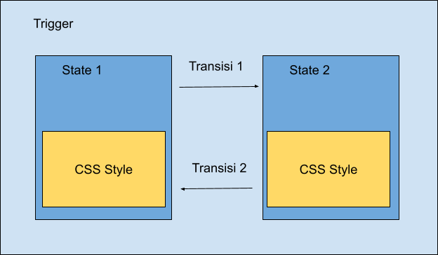
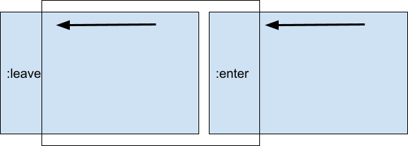
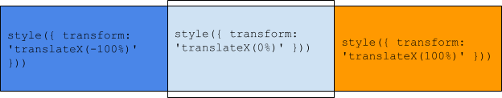

# Animasi

## Video

Segera hadir.

## Konsep Animasi pada Angular

Angular menyediakan modul untuk mengelola animasi yaitu BrowserAnimationModule. Pastikan modul tersebut terpasang pada modul aplikasi.

### Menerapkan modul animasi pada app.module.ts

```typescript
@NgModule({
 declarations: [
   AppComponent,
   LoginComponent,
   RegisterComponent,
   ForgotComponent,
   AnimationComponent
 ],
 imports: [
   BrowserModule,
   AppRoutingModule,
   BrowserAnimationsModule, // modul animasi
   FormsModule,
   MaterialDesign,
   HttpClientModule,
   ReactiveFormsModule
 ],
 providers: [],
 bootstrap: [AppComponent]
})
```

## Trigger, State, dan Transition



Animasi pada Angular dibingkai oleh ‘trigger'. Pada fungsi trigger tersebut terdapat state untuk mengatur kondisi dan juga transition untuk mengatur perpindahan antara state satu ke state lain. Perhatikan contoh implementasi animasi pada sebuah komponen berikut ini:

### Penerapan atribut animasi pada komponen

```typescript
@Component({
 selector: 'app-animation',
 templateUrl: './animation.component.html',
 styleUrls: ['./animation.component.scss'],
 animations:[
   trigger('myAnimation',[
     state(
       'open',
       style(
       {
         backgroundColor:'red',         
         transform:'scale(1,1)'
       }
       )
     ),
     state('close',style(
       {
         backgroundColor:'red',         
         transform:'scale(0.5,0.5)'
       }
     )),
     transition('open => close', [
       animate('0.5s')
     ]),
     transition('close => open', [
       animate('0.5s')
     ])
   ])
 ]
})
```

Animasi pada kode diatas dibingkai dalam trigger bernama ‘myAnimation' yang didalamnya berisi dua state yakni state ‘open' dan state ‘close'. Transisi pada animasi diatas diatur oleh dua fungsi transisi yaitu ‘open => close' untuk mengatur perpindahan dari state ‘open' ke state ‘close' dan juga transisi ‘close => open' untuk mengatur perpindahan dari state ‘close' ke state ‘open'.

## Menjalankan Animasi

Animasi dijalankan menggunakan sebuah ekspresi di dalam elemen HTML. Format penulisannya adalah:

```html
<div [@namaTrigger]="namaState"></div>
```

namaState dapat ditentukan berdasdarkan sebuah variabel boolean, misalnya:

```html
<div [@namaTrigger]="isOpen ? 'state1' : 'state2'"></div>
```

Jika variabel isOpen bernilai true maka state 1 akan dijalankan dengan nilai transisi seperti yang sudah ditentukan pada komponen. Berikut ini adalah kode lengkap untuk menerapkan animasi pada sebuah komponen.

### #1 - Membuat komponen baru

```
ng g c animation
```

### #2 - Mendefinisikan animasi pada animation.component.ts

```typescript
import { Component, OnInit } from '@angular/core';
import { trigger, state, transition, animate, style } from '@angular/animations';

@Component({
 selector: 'app-animation',
 templateUrl: './animation.component.html',
 styleUrls: ['./animation.component.scss'],
 animations:[
   trigger('myAnimation',[
     state(
       'open',
       style(
       {
         backgroundColor:'red',         
         transform:'scale(1,1)'
       }
       )
     ),
     state('close',style(
       {
         backgroundColor:'red',         
         transform:'scale(0.5,0.5)'
       }
     )),
     transition('open => close', [
       animate('0.5s')
     ]),
     transition('close => open', [
       animate('0.5s')
     ])
   ])
 ]
})
export class AnimationComponent implements OnInit {
 isOpen:boolean=false;
 constructor() { }
 ngOnInit(): void {
 }
}
```

### #3 - Menjalankan animasi pada animation.component.html

```html
<div class="uk-flex uk-grid uk-flex-column uk-flex-center uk-flex-middle uk-height-viewport">
   <div class="uk-width-1-3 uk-flex uk-flex-column uk-flex-center uk-flex-middle">
       <div [@myAnimation]="isOpen ? 'open':'close'" style="width: 100%; padding-bottom: 100%;"></div>
       <button mat-button (click)="isOpen = !isOpen">Play</button>
   </div>   
</div>
```

Perhatikan potongan kode berikut:

```
[@myAnimation]="isOpen ? 'open':'close'" 
```

Trigger animasi dengan nama ‘myAnimation' yang sudah dibuat pada animation.component.ts dijalankan dengan memanfaatkan variabel isOpen sebagai kontrol. Jika isOpen bernilai true maka state dengan nama ‘open' akan dijalankan demikian sebaliknya. Jika state pada saat animasi dijalankan berada pada kondisi ‘close' maka transisi yang digunakan adalah ‘close => open' demikian sebaliknya.

## Penerapan Animasi pada Transisi Halaman

Halaman pada angular dibingkai oleh router-outlet. Dengan demikian penerapan animasi untuk transisi halaman diterapkan pada komponen yang memuat router-outlet pada template. Pada studi kasus yang digunakan, router-outlet ada pada admin.component.html sehingga atribut animasi diterapkan pada admin.component.ts. Ikuti prosedur berikut ini untuk menerapkan animasi pada transisi halaman dalam modul admin.

### #1 - Menambahkan atribut animasi pada admin.component.ts

```typescript
@Component({
 selector: 'app-admin',
 templateUrl: './admin.component.html',
 styleUrls: ['./admin.component.scss'],
 animations:[
   trigger('routeAnimations', [
     transition('* <=> *', [       
       query(':enter, :leave',
       style({ position: 'fixed',  width: '100%' })
       ),
       group([
             query(':enter', [
                 style({ transform: 'translateX(100%)' }),
                 animate('0.5s ease-in-out',
                 style({ transform: 'translateX(0%)' }))
             ], { optional: true }),
             query(':leave', [
                 style({ transform: 'translateX(0%)' }),
                 animate('0.5s ease-in-out',
                 style({ transform: 'translateX(-100%)' }))
                 ], { optional: true }),
         ])
     ]),
 ])
 ]
})
```

Penerapan animasi untuk transisi halaman tidak memerlukan state yang didefinisikan pada komponen. Fungsi trigger hanya memuat transition yang didalamnya terdapat query dan group.



Fungsi `query(‘:enter, :leave')` mendefinisikan posisi fixed untuk membuat halaman tidak bertumpuk. Fungsi `group()` yang berisi `query(‘:enter')` dan `query(‘:leave')` membuat animasi berjalan bersamaan untuk dua kondisi yang berbeda. Jika kondisinya adalah :leave maka elemen digeser ke kiri dari posisi normal dan jika kondisinya adalah :enter maka elemen digeser ke posisi normal dari sisi kanan. Perhatikan ilustrasi pada gambar berikut:



### #2 - Menambahkan elemen trigger pada admin.component.html

```html
<mat-sidenav-content [@routeAnimations]="o && o.activatedRouteData
   && o.activatedRouteData['animation']">   
       <router-outlet #o="outlet"></router-outlet>   
</mat-sidenav-content>
```

Pada bagian sebelumnya, trigger animasi dikendalikan oleh sebuah variabel boolean yang didefinisikan pada komponen kemudian variabel tersebut diperbarui oleh aktivitas tombol. Animasi transisi halaman tidak menggunakan skema trigger seperti yang sudah diterapkan sebelumnya, tapi menggunakan aktivitas router dengan menambahkan #o="outlet" pada elemen router-outlet untuk memantau aksi yang terjadi pada router tersebut. Animasi akan dijalankan jika nilai `o.activatedRouteData['animation']"` adalah true. Key Array bernama ‘animation' merupakan atribut yang diberikan pada routes yang ada pada admin.module.ts.

### #3 - Menambahkan data routes pada admin.module.ts

```typescript
...
const routes: Routes = [
 {
   path:'',
   component:AdminComponent,
   children:[
     {
       path:'dashboard',
       component:DashboardComponent,
       data:{animation:'dashboard'}
     },  
     {
       path:'product',
       component:ProductComponent,
       data:{animation:'product'}
     },   
     {
       path:'',
       pathMatch:'full',
       redirectTo:'/admin/dashboard'
     }
   ]
 } 
]
...
```

Penambahan atribut `data:{animation:'namaState'}` digunakan untuk memberikan inisial state animasi yang nantinya akan dibaca oleh komponen yang mengatur animasi transisi halaman.

## Animasi pada List Data Menggunakan Stagger

Animasi dapat juga diterapkan pada list data yang dibuat menggunakan perulangan *ngFor. Animasi pada angular menyediakan fungsi stagger() untuk memberikan efek diam dalam durasi waktu tertentu sebelum mengeksekusi situasi lain yang ditentukan. Untuk keperluan demonstrasi, kita akan memanfaatkan komponen dashboard untuk membuat animasi list data yang diterapkan pada mat-card. Ikuti langkah berikut:

### #1 - Mendefinisikan animasi pada dashboard.component.ts

```typescript
...
@Component({
 selector: 'app-dashboard',
 templateUrl: './dashboard.component.html',
 styleUrls: ['./dashboard.component.scss'],
 animations:[
   trigger('listAnimation',[
     transition('* => *',[
       query(':enter',
     [style({ opacity: 0, transform:'translateY(50px)' }), stagger('300ms', animate('600ms ease-out', style({ opacity: 1, transform:'translateY(0px)' })))],
     { optional: true }
   ),
   query(':leave',
     animate('200ms', style({ opacity: 0 })),
     { optional: true}
   )
     ])
   ])
 ]
})
...
```

Transition memuat dua query() yaitu untuk menangani kondisi :enter dan :leave. Pada kondisi :enter nilai opacity elemen adalah 0 sedangkan posisi digeser sebesar 50 pixel ke arah Y (arah bawah). Diterapkan stagger(‘600ms') yang berarti terdapat delay selama 600ms sebelum mengeksekusi kondisi lain yakni opacity 1 dan posisi normal. Delay tersebut akan membuat elemen muncul secara bergantian.

### #2 - Mendefinisikan data perulangan pada dashboard.component.ts

```typescript
...
export class DashboardComponent implements OnInit {
 constructor() { }
 ngOnInit(): void {
   this.isOpen=true;
   setTimeout(()=>{
     this.toggleData();
   },1000)   
 }
 data:any=[];
 toggleData()
 {
   this.data= this.data.length ? [] : [1,2,3,4,5,6,7,8,9];
 }
}
```

Animasi berjalan pada kondisi :enter sehingga nilai awal untuk data adalah ‘[ ]' yang berarti array tersebut tidak memiliki item. Variabel data akan diisi saat halaman dimuat menggunakan fungsi ngOnInit(). Pemanggilan fungsi toggleData() dimasukkan ke dalam fungsi setTimeOut() agar kondisi :enter dapat terlihat. Fungsi toggleData() juga berfungsi untuk menghapus list sehingga kondisi :leave dapat terlihat.

### #3 - Membuat list pada dashboard.component.html

```html
<button mat-button (click)="toggleData()">Toggle Data</button>
<div [@listAnimation]="data.length" class="uk-margin">  
       <mat-card *ngFor="let n of data" class="uk-margin">
           <h2 >Dashboard {{n}}</h2>          
       </mat-card>  
</div>
```

Trigger animasi menggunakan nilai variabel data. Fungsi toggleData() akan membuat nilai data.length berubah antara 0 dan jumlah item pada data. Nilai 0 akan dibaca false dan bilangan lebih dari 0 akan dibaca true.

