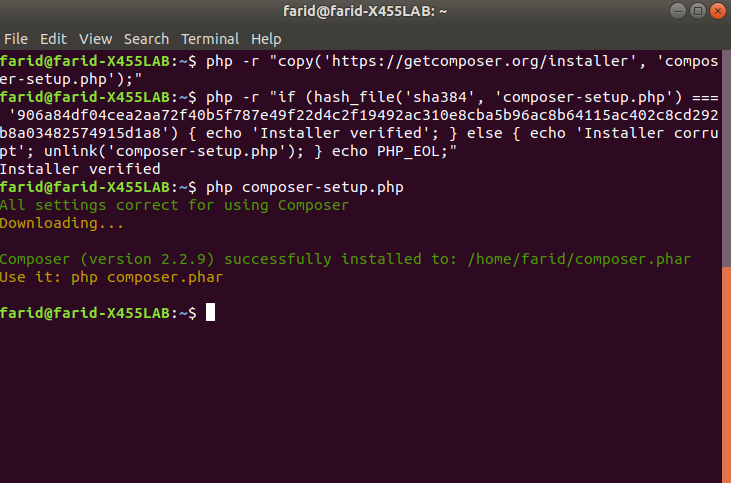
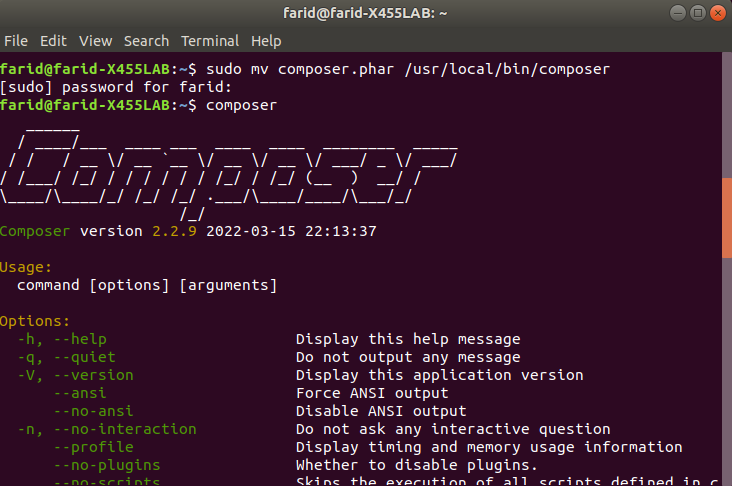

# Instalasi composer pada Ubuntu

1. Pastikan pada komputer Anda sudah terinstall PHP CLI.

2. Eksekusi perintah berikut secara berurutan menggunakan terminal.

   ```bash
   php -r "copy('https://getcomposer.org/installer', 'composer-setup.php');"
   ```

   ```
   php -r "if (hash_file('sha384', 'composer-setup.php') === '906a84df04cea2aa72f40b5f787e49f22d4c2f19492ac310e8cba5b96ac8b64115ac402c8cd292b8a03482574915d1a8') { echo 'Installer verified'; } else { echo 'Installer corrupt'; unlink('composer-setup.php'); } echo PHP_EOL;"
   ```

   ```
   php composer-setup.php
   ```

   

   Gambar diatas adalah contoh proses pada instalasi composer. Kemudian, perintah berikut adalah untuk menghapus file instalasi.

   ```
   php -r "unlink('composer-setup.php');"
   ```

3. Composer sudah terpasang tapi belum dapat digunakan. Agar dapat digunakan, eksekusi perintah berikut:

   ```
   sudo mv composer.phar /usr/local/bin/composer
   ```

   Hasil eksekusi perintah di atas adalah seperti pada gambar berikut:

   

Composer sudah berhasil terinsal!