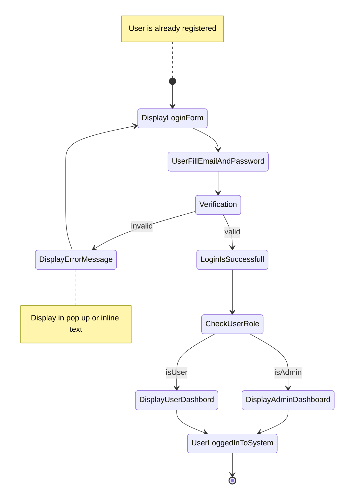

# Implementasi Activity Diagram


Activity diagram merupakan salah satu bagian dari UML untuk memodelkan aktivitas sebuah sistem. Activity diagram, demikian juga state diagram, disebut juga dengan behaviour diagram (diagram perilaku) karena diagram tersebut memvisualkan perilaku sistem dalam berinteraksi dengan pengguna.

Activity diagram membantu komunikasi antara orang-orang dalam domain bisnis dan orang-orang dalam domain pengembangan sistem untuk menyamakan persepsi tentang sebuah proses bisnis yang seharusnya berlaku. 

Manfaat activity diagram dalam pengembangan sistem diantaranya adalah:

- Mendemonstrasikan logika suatu algoritma.
- Menggambarkan proses bisnis atau alur kerja antara pengguna dan sistem.
- Memodelkan elemen arsitektur perangkat lunak, seperti metode, fungsi, dan operasi.

Dalam proses pengembangan perangkat lunak Sistem Informasi, activity diagram sangat membantu dalam memberikan gambaran visual tentang proses bisnis antara pengguna perangkat lunak dan sistem dengan cara yang lebih dapat dimengerti oleh semua stakeholder organisasi. 

##  Contoh Activity Diagram

**Use Case**

| Use Case      | User login ke sistem                                         |
| ------------- | ------------------------------------------------------------ |
| Actors        | Admin, user                                                  |
| Description   | Penggunaan login adalah untuk membedakan pengguna sekaligus untuk melindungi data-data yang milik seorang pengguna. Login dapat dilakukan oleh admin dan user melalui satu halaman login yang sama. Data yang digunakan untuk melakukan login adalah email dan password. |
| Pre-condition | User sudah terfaftar pada sistem                             |
| Normal Flow   | - Pengguna mengisi email dan password pada formulir login<br />- Pengguna memperoleh informasi jika terjadi kesalahan<br />- Pengunguna dengan role Admin diarahkan ke halaman dashboard admin jika login benar<br />- Pengguna dengan role User diarahkan ke halaman dashboard user jika login benar |

**Activity Diagram:**



## Cara Membuat Activity Diagram

Komponen utama activity diagram:

- Elemen start (awal proses)
- Elemen aktivitas pengguna
- Elemen aktivitas sistem (atau state pada state diagram)
- Elemen kondisi
- Elemen percabangan aktivitas
- Elemen Penggabungan aktivias
- Elemen end (akhir proses)

## Penerapan Activity Diagram

Activity diagram pada pengembangan perangkat lunak digunakan oleh UI/UX desainer dan developer untuk membuat tampilan antarmuka pengguna. Activity diagram menggambarkan 'user flow' dalam menyelesaikan sebuah task (use case) dalam sistem melalui tampilan antarmuka pengguna. Dengan menggunakan activity diagram, UI/UX desainer dapat menentukan halaman dan elemen desain yang harus dibuat.

Langkah awal  untuk implementasi activity diagram adalah dengan mengidentifikasi halaman dan elemen desain. Sebagai contoh, kita identifikasi Activity diagram login yang disajikan pada bagian contoh activity diagram. Halaman dan elemen yang harus disediakan adalah:

- Halaman login berisi formulir yang memuat kolom email dan password serta tombol login.
- Elemen untuk menampilkan informasi jika terjadi error.

Pada pola pemrograman menggunakan MVC (Model View Controller), activity diagram lebih fokus pada bagian View dan Controller karea bagian tersebut adalah bagian yang secara langsung berinteraksi dengan pengguna. Penerapan activity diagram untuk use case login pada pola pemrograman MVC dapat dilakukan dengan langkah berikut:

Membuat elemen View misalnya dengan membuat file login.html

```html
<form action="/login" method="POST">
<label>Email</label>
    <input type="text">
    <label>Password</label>
    <input type="password">
    <button type="submit">
        Login
    </button>
</form>
```


## Perbedaan Activity Diagram dan Sequence Diagram

