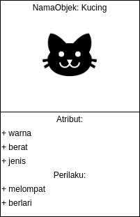
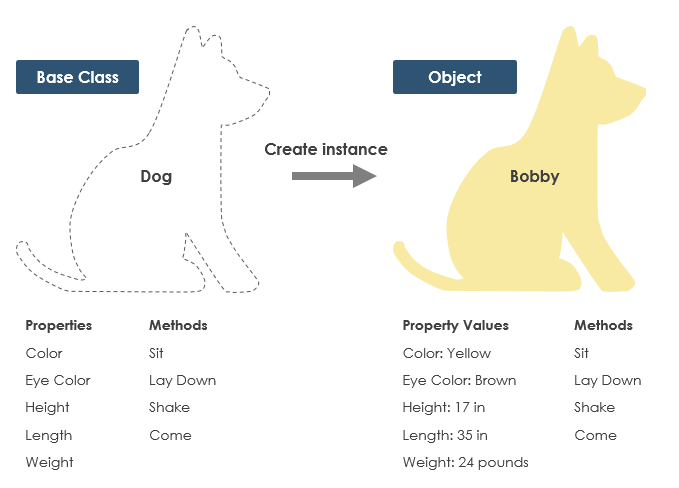
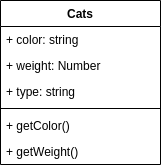
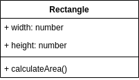
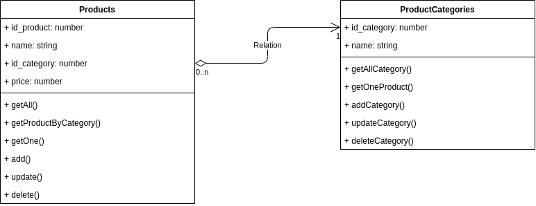

# Implementasi Class Diagram

***Writen By: Farid Suryanto, Sistem Informasi UAD***


Bagian ini membahas tentang penarapan Class Diagram dalam pengembangan perangkat lunak. Pada bagian ini Anda akan mempelajari tentang:

- Apa itu Class Diagram
- Implementasi class diagram dalam pemrograman berorientasi objek (OOP)
- Penerapan Class Diagram dan OOP dalam Pengembangan Sistem Informasi
  - Desain Database Berdasarkan Class Diagram
  - Implementasi Class Diagram pada Pemrograman Sisi Server (Back End) Menggunakan NodeJS

## Apa itu Class Diagram?

Class Diagram adalah notasi grafis yang digunakan untuk membangun dan memvisualkan pemrograman sistem berorientasi objek. Class Diagram merupakan salah satu jenis UML (Unified Modelling Language) yang sering digunakan untuk pemodelan perangkat lunak sebelum masuk dalam tahap produksi. Biasanya Class Diagram masuk dalam dokumen Software Design Document (SDD) yang menjadi panduan kerja bagi programmer. Selain programmer Class Diagram juga digunakan oleh Tester Engineer untuk menyusun desain Test Case. Class Diagram biasanya dibuat oleh Software Analyst (SA) yang bertanggungjawab untuk menyusun dokumen Software Requirement Specification (SRS) dan SDD.

Class pada class diagram merupakan sebuah kategori yang merepresentasikan objek. Objek merupakan segala sesuatu yang terlihat atau nyata dan bentuknya relatif stabil. Setiap objek memiliki sifat dan perilaku. Misalnya objek bernama 'kucing'. Objek tersebut memiliki atribut warna, berat, jenis, dll yang mungkin saja berbeda antara kucing satu dengan lainnya. Objek kucing juga memiliki perilaku yang berbeda.



'Kucing' pada contoh diatas adalah nama class. Warna, berat, dan jenis merupakan attribut class sedangkan melompat dan berlari merupakan method atau operation dalam class. 



Ilustrasi pada gambar diatas menunjukkan gambaran yang lebih jelas mengenai class dan objek. Base Class merupakan sebuah 'wadah' yang dapat diisi dengan objek yang memiliki komposisi atribut dan metode yang sama. Berdasarkan base class yang dibuat Anda dapat membuat lebih dari satu objek yang masuk dalam class 'Dog'. 

Class pada class diagram dinotasikan menggunakan blok yang terdiri dari beberapa bagian yaitu nama class, atribut, dan metode. Gambar dibawah merupakan sebuah class dalam class diagram. Class tersebut bernama **Cats** dan memiliki atribut color, weight, dan type serta memiliki metode `getColor()` dan `getWeight()`. 




## Implementasi class diagram dalam pemrograman berorientasi objek (OOP)

Pemrograman berorientasi objek atau lebih dikenal dengan OOP (*Object Oriented Programming*) merupakan  paradigma pemrograman berdasarkan objek (memiliki data dan metode) yang bersifat modular dan reusable. *Modular* berarti terdiri dari beberapa bagian yang terkait satu dengan lainnya. *Reusable* berarti objek tersebut dapat digunakan kembali di tempat lain. Objek digunakan untuk berinteraksi satu sama lain untuk merancang aplikasi dan program komputer.



Gambar diatas adalah sebuah class diagram dengan nama **Rectangle** yang memiliki dua atribut yaitu widht dan height serta satu method `calculateArea()`. Class diagram tersebut jika dikonversi dalam sebuah program menggunakan Javascript maka menjadi:

**code/js/class_example_1.js**

```javascript
class Rectangle{
    width;
    heigth;
    calculateArea()
    {
        return this.width*this.heigth;
    }
}
let myRect = new Rectangle();
myRect.width = 10;
myRect.heigth = 9;
console.log(myRect.calculateArea()); //output: 90
```

**code/php/class_example_1.php**

```php
<?php
class Rectangle{
    public $width;
    public $height;

    public function calculateArea()
    {
        return ($this->width*$this->height);
    }
}
$myRect = new Rectangle();
$myRect->width = 10;
$myRect->height = 9;
echo $myRect->calculateArea(); //output: 90
?>
```

Kode program di atas merupakan contoh implementasi OOP menggunakan Javascript dan PHP yang mengacu pada desain class diagram 'Rectangle'.  Variabel myRect merupakan objek yang dibuat berdasarkan class model yang dibuat pada class diagram 'Rectangle'.

## Penerapan Class Diagram dan OOP dalam Pengembangan Sistem Informasi

Class diagram dalam pengembangan sistem informasi digunakan untuk membuat model data baik pada sisi server maupun sisi klien. Pada sisi server biasanya class diagram digunakan untuk membangun data model dalam pengembangan Application Programming Interface (API).

Gambar dibawah ini adalah contoh class diagram yang digambar berdasarakan hasil analisis proses bisnis. Data-data yang muncul akibat dari proses bisnis dikategorikan dalam class kemudian ditentukan attribut dan metodenya. Ada dua class yang digunakan untuk menangani objek 'produk' yaitu class Products dan ProductCategories. Class Products berelasi dengan ProductCategories untuk menangani kategorisasi produk.



Dalam pengembangan sistem informasi, class diagram dapat dijadikan panduan untuk membangun API termasuk membuat struktur database. 

### Desain Database Berdasarkan Class Diagram

Berdasarkan class diagram, kita dapat membuat struktur database yakni menggunakan atribut-atribut yang ada pada setiap class. Dari dua class diagram 'Products' dan 'ProductCategories' dapat dibuat dua tabel database:

**Nama Tabel: products**

| Field Name  | Type    |
| ----------- | ------- |
| id_product  | integer |
| name        | varchar |
| id_category | integer |
| price       | integer |

**Nama Tabel: product_category**

| Field Name  | Type    |
| ----------- | ------- |
| id_category | integer |
| name        | varchar |

### Implementasi Class Diagram pada Pemrograman Sisi Server (Back End) Menggunakan NodeJS

#### Identitas Aplikasi

```
Nama Aplikasi		: API Store App
Versi				: 0.0.1
Language			: Javascript
Runtime				: NodeJS
```

#### Prerequested:

- NodeJS
- Mysql
- Class diagram Product

#### Get Started

1. Buat folder dengan nama nodejs_api.

2. Jalankan perintah `npm init` melalui console atau terminal pada folder nodejs_api.

3. Jalankan perintah `npm install mysql` melalui console atau terminal pada folder nodejs_api.

4. Siapkan database. Buat database msql dengan nama `app_store`

5. Buat tabel products di dalam database `app_store`.

   ```sql
   CREATE TABLE `products` (
     `id_product` int(100) NOT NULL,
     `name` varchar(255) NOT NULL,
     `id_category` int(100) NOT NULL,
     `price` int(255) NOT NULL
   ) ENGINE=InnoDB DEFAULT CHARSET=utf8mb4;
   ```

   

#### Struktur File

```
+ config
	- database.js
+ model
	- products.js
+ node_modules
- app_test.js
- package.json
- package-lock.json
```

Folder node_modules, file package.json, dan package-lock.json adalah file yang dibuat secara otomatis saat menjalankan perintah `npm init`. 

#### Koneksi Database

**database.js**

```javascript
const mysql = require('mysql');

const con = mysql.createConnection({
    host: "localhost",
    user: "root",
    password: "",
    database: "app_store"
});

con.connect(function(err) {
    if (err) throw err;
    console.log("Connected!");
});

module.exports = con
```

#### Class Products

**products.js**

```javascript
//Class: Products
const con = require('../config/database');
module.exports = {
    id_product: null,
    name: null,
    id_category: 0,
    price: 0,
    getAll : function()
    {
        const dt = new Promise((resolve, reject)=>{
            con.query("SELECT * FROM products", (err, result, fields) => {
                if (err) throw err;
                resolve(result);
            });
        });
        return dt;
    },
    getByCategory: function()
    {
        const dt = new Promise((resolve, reject)=>{
            con.query("SELECT * FROM products WHERE id_category = '"+this.id_category+"'", (err, result, fields) => {
                if (err) throw err;
                resolve(result);
            });
        });
        return dt;
    },
    getOne  : function(id) {
        const dt = new Promise((resolve, reject)=>{
            con.query("SELECT * FROM products WHERE id_product = '"+id+"'", (err, result, fields) => {
                if (err) throw err;
                resolve(result[0]);
            });
        });
        return dt;
    },
    add: function(){
        let name = "'"+this.name+"'";
        let id_category = this.id_category;
        let price = this.price;
        let values = [name, id_category, price];
        const dt = new Promise((resolve, reject)=>{
            con.query("INSERT INTO products (name, id_category, price) VALUES ("+values.join(",")+")", (err, result, fields) => {
                if (err) throw err;
                resolve(result);
            });
        });
        return dt;
    },
    update : function(){
        const dt = new Promise((resolve, reject)=>{
            con.query("UPDATE products SET name = '"+this.name+"', id_category="+this.id_category+", price = "+this.price+" WHERE id_product = "+this.id_product+"", (err, result, fields) => {
                if (err) throw err;
                resolve(result);
            });
        });
        return dt;
    },
    delete : function(){
        const dt = new Promise((resolve, reject)=>{
            con.query("DELETE products WHERE id_product="+this.id_product+"", (err, result, fields) => {
                if (err) throw err;
                resolve(result);
            });
        });
        return dt;
    }
}
```

#### Program Ujicoba Eksekusi Class Products

**app_test.js**

```js
const products = require("./model/products");
let postDataTest = {
    name: "Product 5",
    id_category: 1,
    price: 5000
};

//call function for test
getAll();

//getAll
function getAll()
{
    products.getAll().then(val=>{
        console.log(val);
    });
}

//get by category
function getByCategory()
{
    products.id_category = 2;
    products.getAll().then(val=>{
        console.log(val);
    });
}
//add data
function add()
{
    products.name = postDataTest.name;
    products.id_category = postDataTest.id_category;
    products.price = postDataTest.price;
    products.add().then(val=>{
        console.log(val);
    });
}
//edit data
function update()
{
    products.id_product = 2;
    products.name = postDataTest.name;
    products.id_category = postDataTest.id_category;
    products.price = postDataTest.price;
    products.update().then(val=>{
        console.log(val);
    });
}
```

#### Eksekusi Program

Arahkan console atau terminal ke folder nodejs_api dan tuliska perintah:

```bash
node app_test.js
```

Perintah tersebut memanggil fungsi `getAll()`dan akan menghasilkan output data yang tersimpan pada database `app_shop` tabel `products`. Untuk mencoba fungsi lain, ganti pemanggilan fungsi pada bagian _call function for test_. 

#### Penjelasan Program

Implementasi Class Diagram Products pada program API Store App dibangun menggunakan metode Export Class. Class ditulis pada folder model dan dibuat berdasarkan nama class. Misal, class products dibuat pada file products.js yang berada dalam folder model. Jika ada class lain maka ditulis dalam folder model dengan pola penamaan file yang sama yakni mengacu pada nama class yang ada pada class diagram.

Contoh pola penulisan program untuk class diagram:

**products.js**

```javascript
modules.exports = {
	attribute_1: null,
	attribute_2: null,
	method_1: function(){
		//kode program disini
	},
	method_2: function(){
		//kode program disini
	}
}
```

Kode program products.js mungkin memerlukan koneksi database untuk mengelola penyimpanan data. Pada contoh program, database yang digunakan adalah mysql. Anda dapat menggunakan database lain misalnya mogodb.

Pemanggilan class model di file yang lain (misal: file untuk mengelola request dari client):

**app.js**

```javascript
const products = require("path/to/exported_module");
let allProducts = products.getAll();
```

