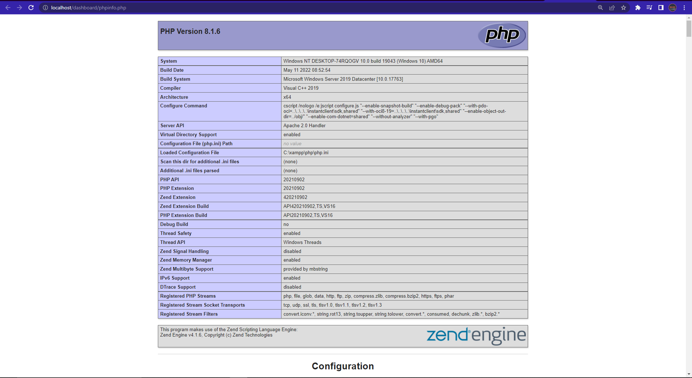
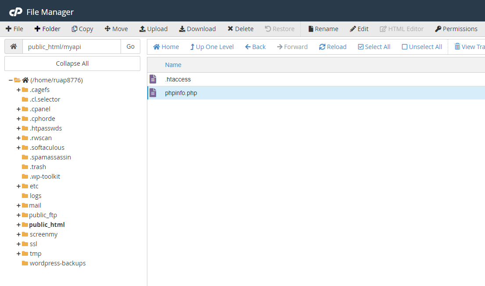
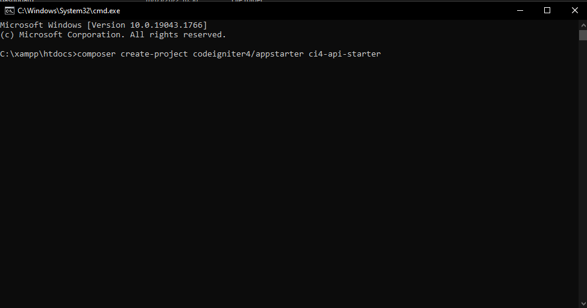
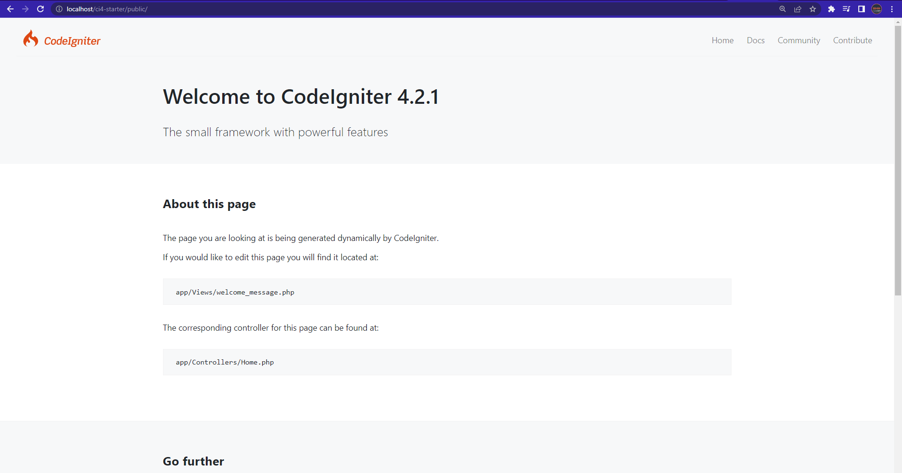
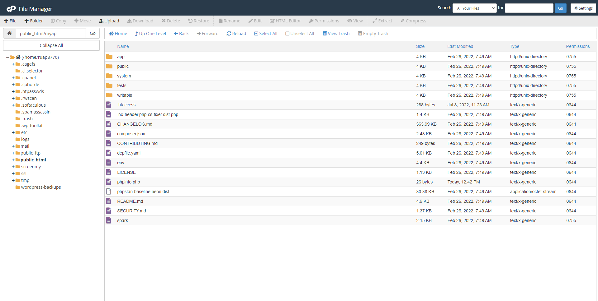

# Membuat API menggunakan Codeigniter 4

## Apa yang dipelajari?

- Instalasi Codeigniter 4
- Pengaturan API points 
- Koneksi database
- Penggunaan Codeigniter model
- Penggunaan session untuk otentikasi pengguna

## Instalasi Codeigniter 4

Ada dua cara instalasi CI4 yaitu cara manual dan menggunakan composer.

### Persyaratan Sistem

Ini adalah hal penting sebelum Anda memulai membangun sistem menggunakan Codeigniter 4. Periksa sistem Anda dan pastikan memenuhi aspek berikut ini:

1. Versi PHP minimal adalah 7.4. Disarankan Anda menggunakan PHP 8.1.
2. Terpasang extension `mbstring` dan `intl`.

Jika Anda melakukan instalasi PHP menggunakan XAMPP maka periksa versi PHP dengan membuka halaman [PHP Info](http://localhost/dashboard/phpinfo.php) melalui browser Anda. Pada gambar dibawah, versi PHP yang dipakai adalah 8.1.6.



### Memeriksa persyaratan sistem di web hosting

Jika Anda akan mempublikasikan aplikasi berbasis Codeigniter 4 Anda ke web hosting, Anda juga harus memastikan bahwa persyaratan sistem sudah terpenuhi. Untuk memeriksanya, Anda dapat membuat sebuah file `phpinfo.php` di hosting Anda dan tuliskan kode berikut ini:

```php
<?php
echo phpinfo();
?>
```



Gambar di atas adalah contoh file `phpinfo.php` yang diletakkan pada sub-domain `https://myapi.ruang-ekspresi.id`. Gambar tersebut menunjukkan bahwa versi PHP yang digunakan adalah versi 7.4.


### Instalasi Menggunakan Composer

Untuk melakukan instalasi ini, Anda memerlukan composer yang sudah terpasang di perangkat Anda. Anda dapat mengikuti [panduan ini](https://faridsurya.github.io/belajar/#/howto/content/install_composer_ubuntu) untuk melakukan instalasi composer.

#### 1 - Menjalankan perintah instalasi menggunakan composer

Arahkan command line (cmd) ke folder yang akan digunakan untuk menyimpan file project Codeigniter kemudian tuliskan perintah composer berikut ini:

```bash
composer create-project codeigniter4/appstarter api-ci4-starter 
```



Perintah tersebut akan membuat folder baru yaitu `api-ci4-starter` yang berisi file-file project codeigniter 4.

Ada dua cara untuk mencoba sistem Codeigniter 4 yang baru saja diinstal yaitu:

1. Menggunakan perintah melalui CMD. Arahkan CMD ke folder project CI4 dan tulis perintah dibawah ini:
    ```
    php spark serve
    ```
    Perintah tersebut akan mengaktifkan web server baru dengan alamat: `http://localhost:8080`. 
2. Menggunakan web service misalnya Apache via XAMPP. Untuk menggunakan ini, folder project CI4 Anda harus berada dalam folder `htdoc` XAMPP. Aktifkan XAMPP terlebih dahulu kemudian buka melalui browser dengan alamat: `http://localhost/api-ci4-starter/public`.

    

    Gambar di atas adalah contoh instalasi yang berhasil dilakukan. Jika Anda menjalankan aplikasi dengan cara ke-2 maka Anda harus mengakses ke folder `public`. Demikian juga jika Anda melakukan instalasi dengan cara manual. Anda harus mengkases ke folder public.

#### 2 - Instalasi manual

Instalasi manual adalah instalasi dengan cara mengunduh file master Codeigniter 4 kemudian menaruhnya di folder `htdoc` XAMPP atau di hosting.



Gambar di atas adalah file-file codeigniter 4 yang tersimpan pada hosting yang berelasi dengan sub-domain `https://myapi.ruang-ekspresi.id`. Untuk memeriksa sukses atau tidaknya instalasi, Anda dapat membuka halaman dengan mengakses domain yang Anda install codeigniter 4. Pada kasus ini, saya memasang codeigniter 4 pada sub-domain [https://myapi.ruang-ekspresi.id](https://myapi.ruang-ekspresi.id).

### Memindahkan folder public ke root folder domain atau sub-domain

Instalasi codeigniter 4 secara manual menyisakan masalah yaitu kita harus mengakses folder `public` untuk dapat menjalankan aplikasi. Misalnya harus mengakses [https://myapi.ruang-ekspresi.id](https://myapi.ruang-ekspresi.id/public) ketika kita baru saja mengunggah file codeigniter 4 ke hosting.

URL tersebut dapat diganti dengan [https://myapi.ruang-ekspresi.id](https://myapi.ruang-ekspresi.id) dengan cara memindahkan file-file yang berada di folder `public` ke root folder hosting.


## Pengaturan API Points 

## Koneksi Database

## Penggunaan Model

## Penggunaan Session untuk Authentication
