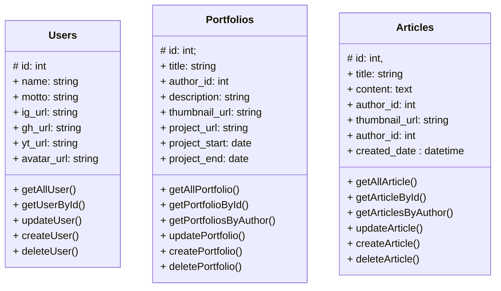

# Studi Kasus Pengembangan API

Studi kasus ini akan mengambil project yang [sebelumnya](https://faridsurya.github.io/belajar/#/vue_basic/content/introduction) sudah dibuat. Untuk membangun API, pertama yang harus dilakukan adalam menentukan API Points yang diperlukan pada pengembangan aplikasi sisi klien (front-end). Berdasarkan studi kasus tersebut, dapat kita petakan API Points sebagai berikut:

## API Points

Beberapa entitas yang diperlukan dalam pengembangan aplikasi diantaranya adalah users, portfolios, dan articles.

### Users

#### Menampilkan data semua pengguna

```
GET: /users

response:
[
    {
        "id"            : "",
        "name"          : "",
        "motto"         : "",
        "ig_url"        : "",
        "fb_url"        : "",
        "gh_url"        : "",
        "yt_url"        : "",
        "avatar_url"    : ""
    },
    ...
]
```

#### Menampilkan data pengguna dengan `id` tertentu

```
GET: /users/[id]

reponse:
{
    "id"            : "",
    "name"          : "",
    "motto"         : "",
    "ig_url"        : "",
    "fb_url"        : "",
    "gh_url"        : "",
    "yt_url"        : "",
    "avatar_url"    : ""
}
```

#### Menambahkan data pengguna

```
POST: /users

data:
{
    "name"          : "",
    "motto"         : "",
    "ig_url"        : "",
    "fb_url"        : "",
    "gh_url"        : "",
    "yt_url"        : "",
    "avatar_url"    : ""
}

response:
true    // if success
false   // if failure
```

#### Edit data pengguna

```
PUT: /users

data:
{
    "id"            : "",
    "name"          : "",
    "motto"         : "",
    "ig_url"        : "",
    "fb_url"        : "",
    "gh_url"        : "",
    "yt_url"        : "",
    "avatar_url"    : ""
}

response:
true    // if success
false   // if failure

```

#### Menghapus data anggota

```
DELETE: /users/[id]

response:
true    // if success
false   // if failure
```

### Portfolios

#### Menampilkan semua data portfolio

```
GET: /portfolios

response:
[
    {
        "id"            : "",
        "author_id"     : "",
        "author_name"   : "",
        "title"         : "",
        "description    : "",
        "thumbnail_url" : "",
        "technologies"  : ["", "", ...],
        "project_url"   : "",
        "project_start" : "",
        "project_end"   : ""
    },
    ...
]
```
#### Menampilkan semua data portfolio oleh penulis tertentu

```
GET: /portfolios/author/author_id

response:
[
    {
        "id"            : "",
        "author_id"     : "",
        "author_name"   : "",
        "title"         : "",
        "description    : "",
        "thumbnail_url" : "",
        "technologies"  : ["", "", ...],
        "project_url"   : "",
        "project_start" : "",
        "project_end"   : ""
    },
    ...
]
```

#### Menampiklan data portfolio berdasdarkan id

```
GET: /portfolios/[id]

response:

{
    "id"            : "",
    "author_id"     : "",
    "author_name"   : "",
    "title"         : "",
    "description    : "",
    "thumbnail_url" : "",
    "technologies"  : ["", "", ...],
    "project_url"   : "",
    "project_start" : "",
    "project_end"   : ""
}

```

#### Menambahkan data portfolio

```
POST: /portfolios

data:
{
    "author_id"     : "",
    "title"         : "",
    "description    : "",
    "thumbnail_url" : "",
    "technologies"  : ["", "", ...],
    "project_url"   : "",
    "project_start" : "",
    "project_end"   : ""
}

```

#### Memperbarui data portfolio

```
PUT: /portfolios

data:
{
    "id"            : "",
    "author_id"     : "",
    "title"         : "",
    "description    : "",
    "thumbnail_url" : "",
    "technologies"  : ["", "", ...],
    "project_url"   : "",
    "project_start" : "",
    "project_end"   : ""
}

response:
true    // if success
false   // if failure

```

#### Menghapus data portfolio

```
DELETE: /portfolios/[id]

response:
true    // if success
false   // if failure

```

### Articles

#### Menampilkan data semua artikel

```
GET: /articles

response:
[
    {
        "id"            : "",
        "author_id"     : "",
        "author_name"   : "",
        "title"         : "",
        "content"       : "",
        "thumbnail_url" : "",
        "author_id"     : "",
        "created_date"  : ""
    }
]

```
#### Menampilkan data artikel oleh penulis tertentu

```
GET: /articles/author/[author_id]

response:
[
    {
        "id"            : "",
        "author_id"     : "",
        "author_name"   : "",
        "title"         : "",
        "content"       : "",
        "thumbnail_url" : "",
        "author_id"     : "",
        "created_date"  : ""
    },
    ...
]
```


#### Menampilkan data artikel dengan id  tertentu

```
GET: /articles/[id]

response:
{
    "id"            : "",
    "author_id"     : "",
    "author_name"   : "",
    "title"         : "",
    "content"       : "",
    "thumbnail_url" : "",
    "author_id"     : "",
    "created_date"  : ""
}
```

#### Menambahkan artikel

```
POST: /articles

data:
{       
    "title"         : "",
    "author_id"     : "",
    "content"       : "",
    "thumbnail_url" : "",
    "author_id"     : "",
    "created_date"  : ""
}

response:
true    // if success
false   // if failure
```

#### Memperbarui artikel

```
PUT: /articles

data:
{      
    "id"            : "", 
    "author_id"     : "",
    "title"         : "",
    "content"       : "",
    "thumbnail_url" : "",
    "author_id"     : "",
    "created_date"  : ""
}

response:
true    // if success
false   // if failure
```

#### Menghapus artikel

```
DELETE: /articles/[id]

response:
true    // if success
false   // if failure
```

## Desain Database

Desain database untuk menyediakan API Points adalah sebagai berikut:

