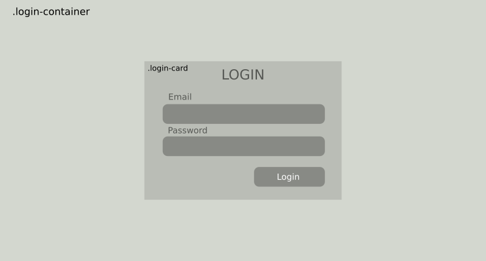

# Style HTML menggunakan CSS 

## Persyaratan

- Menguasai editing kode menggunakan salah satu IDE (integrated Development Environment) misalnya Vs Code
- Menguasai HTML

## Apa yang Dipelajari?

- Langkah awal memahami CSS
- Cara implementasi CSS pada dokumen HTML
- Menentukan style berdasdarkan posisi
- Menentukan style berdasdarkan state (pseudo-class)
- Menentukan jenis font pada CSS
- Referensi style CSS

## Langkah Awal Memahami CSS

### Apa itu CSS?

CSS (*Cascading Style Sheets*) memungkinkan kita untuk membuat halaman web sehingga tampak lebih bagus. Artikel ini menjelaskan apa itu CSS dan menyertakan contoh sintaks sederhana dan juga memuat beberapa hal penting yang perlu diketahui untuk membangun halaman web.

Dalam modul pengenalan HTML kita telah membahas apa itu HTML, dan bagaimana HTML digunakan untuk menandai dokumen. Dokumen-dokumen itu dapat dibaca di browser. Judul akan terlihat lebih besar dari teks biasa, paragraf dipecah menjadi baris baru dan memiliki spasi di antaranya. Tautan diwarnai dan digarisbawahi untuk membedakannya dari teks lainnya. Apa yang Anda lihat adalah style bawaan browser. Style yang sangat dasar yang diterapkan browser ke HTML.

Namun, web akan terlihat membosankan jika semua situs web terlihat seperti itu. Dengan menggunakan CSS, Anda dapat mengontrol dengan tepat bagaimana elemen HTML terlihat di browser dan menampilkan elemen HTML menggunakan desain apa pun yang Anda suka.

### Untuk Apa CSS?

Seperti yang telah disebutkan sebelumnya, CSS adalah bahasa untuk menentukan bagaimana dokumen disajikan kepada pengguna, seperti bagaimana mereka ditata, ditampilkan, dianimasikan, dll. Dokumen biasanya berupa file teks yang terstruktur menggunakan bahasa markup. HTML adalah bahasa markup yang paling umum, tetapi Anda mungkin juga menemukan bahasa markup lain seperti SVG atau XML.

Menyajikan dokumen kepada pengguna berarti mengubahnya menjadi bentuk yang dapat digunakan oleh audiens. Browser, seperti Firefox, Chrome, atau Edge , dirancang untuk menyajikan dokumen secara visual. Secara umum terdapat empat fungsi CSS diantaranya:

- Styling

  Mengatur 'gaya' elemen HTML seperti warna dan ukuran. 

- Layouting

  Mengatur tata letak (posisi) elemen HTML

- Appearance

  Mengatur kemunculan elemen HTML

- Animating

  Mengatur perubahan style (warna, bentuk, ukuran, posisi) elemen HTML berdasarkan durasi waktu tertentu

### Struktur Sintak CSS

Seperti HTML, CSS juga memilki sintak khusus yang terstruktur. Perhatikan contoh berikut:

```html
<h1 class="heading-1">Welcome CSS!</h1>
```

```css
.heading-1{
    font-size: 32px;
    font-weight: 700;
    color: red;
}
#heading-1{
    font-size: 32px;
    font-weight: 500;
    color: green;
}
```

Kode pertama adalah HTML dan kode kedua adalah CSS. Pada HTML terdapat atribut `class` dengan nilai `heading-1`. `heading-1` disebut dengan selector. Selector berfungsi untuk mendandai style CSS yang harus diterapkan pada elemen HTML. Pada contoh diatas, semua elemen HTML yang memuat nilai class `heading-1` akan diterapkan style seperti yang didefinisikan pada kode css: ukuran font 32px, ketebalan font 700, dan warna merah. 

Selector menggunakan atribut `class` ditandai dengan titik (misal: `.heading-1`). Anda juga dapat menggunakan selector lain misalnya atribut `id` atau dapat juga menggunakan elemen HTML misalnya `h1`.

```html
<h1 id="heading-1">Welcome CSS!</h1>
```

Kode HTML di atas menggunakan atribut `id` untuk menerapkan CSS dengan selector `#heading-1`. Jika Anda akan menerapkan CSS untuk semua elemen HTML `h1` maka Anda harus menuliskan css seperti berikut ini:

```css
h1{
    font-size: 32px;
    font-weight: 400;
    color: blue;
}
```

CSS di atas akan diterapkan untuk semua elemen HTML `<h1>` karena selector yang digunakan adalah `h1`.

## Bagaimana Menerapkan CSS

Ada tiga cara untuk menerapkan CSS pada dokumen HTML:

### Menerapkan CSS dengan atribut `style` pada elemen HTML

CSS dapat diterapkan menggunakan atribut HTML yaitu `style`. Berikut ini adalah contoh penerapan CSS menggunakan atribut `style`:

```html
<h1 style="font-size: 42px">Hello Front End Developer!</h1>
```

### Menerapkan CSS dengan melampirkan elemen `<style>` pada dokumen HTML

Cara lain untuk menerapkan CSS adalah dengan menambahkan elemen `style` pada bagian `<head>` dalam dokumen HTML.

```html
<!doctype html>
<html lang="en">
<head>
    <meta charset="utf-8">
    <title>Getting started with CSS</title>
   <style>
        .heading-1{
            font-size: 42px;
            font-weight: 700;
            color: red;
        }
    </style>
</head>
<body>
    <h1 class="heading-1">I am a level one heading</h1>
    <p>This is a paragraph of text. In the text is a <span>span element</span>
and also a <a href="https://example.com">link</a>.</p>
    <p>This is the second paragraph. It contains an <em>emphasized</em> element.</p>
    <ul>
        <li>Item <span>one</span></li>
        <li>Item two</li>
        <li>Item <em>three</em></li>
    </ul>
</body>
</html>
```

Live Demo:

[basic_html](https://codepen.io/faridsurya/embed/vYpWGWm ':include :type=iframe width=100% height=400px')

### Merapkan CSS dengan melampirkan file `.css` secara terpisah

Menerapkan CSS dengan melampirkan file secara terpisah dilakukan menggunakan elemen `<link>` pada HTML. Pada elemen tersebut diterapkan atribut `rel="sytlesheet"` untuk mendandai bahwa yang dilampirkan itu adalah dokumen CSS dan juga menggunakan atribut `href` untuk menunjukkan *path* dari file CSS yang dilampirkan. Perhatikan contoh penerapan berikut ini pada file `index.html` dan `style.css`. File `style.css` dilampirkan secara terpisah pada dokumen `index.html`.

**index.html**

```html
<!doctype html>
<html lang="en">
<head>
    <meta charset="utf-8">
    <title>Getting started with CSS</title>
    <link rel="stylesheet" href="styles.css">
</head>
<body>
    <h1 class="heading-1">I am a level one heading</h1>
    <p>This is a paragraph of text. In the text is a <span>span element</span>
and also a <a href="https://example.com">link</a>.</p>
    <p>This is the second paragraph. It contains an <em>emphasized</em> element.</p>
    <ul>
        <li>Item <span>one</span></li>
        <li>Item two</li>
        <li>Item <em>three</em></li>
    </ul>
</body>
</html>
```
**style.css**

```css
.heading-1{
            font-size: 42px;
            font-weight: 700;
            color: red;
}
```

**Live Demo**

[basic_html](https://codepen.io/faridsurya/embed/jOYaqZQ ':include :type=iframe width=100% height=400px')

## Menentukan *Style* Berdasarkan Posisi

Ini adalah bagian penting bagi seorang front end developer. Desain antar muka biasanya dipisahkan berdasarkan komponen desain misalnya card, navbar, button, footer, dll. Style heading pada card mungkin berbeda dengan style heading yang digunakan pada artikel. Oleh sebab itu pemahaman mengenai penempatan selektor css adalah sangat penting.

Perhatikan contoh css berikut:

```css
.card {
	padding: 10px;
	border: 1px solid #ccc;
}
.card h1{
    font-size: 24px;
    font-weight: 600;
}
.card p{
    font-size: 14px;
    font-height: 14px;
}
```

```html
<div class="card">
    <h1>
        4 Hal yang Penting diketahui oleh Front End Developer!
    </h1>
    <p>
        Jika Anda adalah seorang front end developer maka sebaiknya Anda tahu empat hal penting ini. <a>Klik disini</a> untuk menonton banyak video tutorial front end.
    </p>
</div>
```

Style untuk elemen `<h1>` hanya akan diterapkan jika elemen tersebut berada di dalam elemen dengan class `card`. Selain itu maka style untuk elemen `<h1>` mengukuti style bawaan (default). 

## Menentukan *Style* Berdasarkan *State* (pseudo-class)

Style dapat diterapkan berdasarkan kondisi tertentu. Konsep tersebut dikenal dengan istilah *pseudo-class*. Misalnya kondisi ketika kursor berada di atas elemen, saat mouse di klik, atau saat kursor meninggalkan elemen. Berikut ini adalah contoh CSS untuk memberikan style pada elemen `<a>`. Kode CSS berikut ini adalah contoh implementasi penerapan style berdasdarkan state yang diterapkan pada elemen `<a>`.

```css
/* unvisited link */
a:link {
  color: #FF0000;
}

/* visited link */
a:visited {
  color: #00FF00;
}

/* mouse over link */
a:hover {
  color: #FF00FF;
}

/* selected link */
a:active {
  color: #0000FF;
}
```

Live Demo

[basic_html](https://codepen.io/faridsurya/embed/yLpPVXG ':include :type=iframe width=100% height=400px')

Pada pengembangan web, konsep *pseudo-class* sering diterapkan pada desain antar muka untuk menambah pengalaman pengguna. Misalnya diterapkan pada dropdown menu seperti pada contoh berikut:

[Dropdown menggunakan CSS](https://codepen.io/faridsurya/embed/MWrObQR ':include :type=iframe width=100% height=400px')

## Menentukan Jenis Font pada Web menggunakan CSS

Font adalah aspek cukup penting dalam pengembangan Front End web. Desain web menggunakan font khusus untuk memberikan keunikan pada halaman web yang dibangun. Melampirkan font pada CSS dapat dilakukan dengan dua langkah berikut:

1. Melampirkan file font pada CSS menggunakan `@font-face`.
2. Mendefinisikan font untuk elemen HTML tertentu menggunakan atribut `font-family`.

Berikut ini adalah contoh melampirkan font menggunakan `@font-face` pada CSS:

```css
@font-face {
  font-family: 'Poppins';
  font-style: normal;  
  src: url(https://fonts.gstatic.com/s/poppins/v19/pxiEyp8kv8JHgFVrJJfecg.woff2) format('woff2');
}
```

Atribut `src` dalam `@font-face` mengarah pada file font yang dilampirkan. Anda dapat mengarahkan *path url* tersebut ke file lokal jika Anda memiliki file font tersebut. File font biasanya dalam ekstensi woff, woff2, atau tif. Setelah font tersebut dilampirkan maka langkah berikutnya adalah mendefinisikan font untuk elemen HTML tertentu misalnya `<body>, <h1>, <h2>`, dsb. Perhatikan contoh berikut ini:

```css
body{
    font-family: 'Poppins';
}
h1{
    font-family: 'Poppins';
    font-weight: 600;
}
```

Kode CSS di atas akan membuat semua teks yang ada dalam elemen `<body>` menggunakan jenis font Poppins dan semua teks yang masuk dalam elemen `<h1>` akan menggunakan font Poppins dengan ketebalan 600. 

Dengan demikian Anda dapat menentukan jenis font ang berbeda untuk heading dan body. Misalnya dengan mengacu pada situs-situs penyedia *font pairing* (pasangan font) seperti https://www.fontpair.co/, http://fontjoy.com/, dll maka Anda dapat membuat pasangan font yang diterapkan pada elemen HTML tertentu. Tapi tidak disarankan untuk menggunakan terlalu banyak jenis font untuk satu halaman web. Hal itu karena asalan prinsip desain. Anda perlu mempelajari teori-teori desain untuk memperdalam konsep tersebut.

Saat ini sudah tersedia web yang menyediakan berbagai jenis font dan Anda dapat melampirkan font tersebut dengan mudah pada halaman web Anda. Misalnya font yang disediakan secara gratis oleh Google Font. Contoh berikut adalah cara untuk melampirkan font yang diambil dari https://fonts.google.com/:

```css
@import url("https://fonts.googleapis.com/css?family=Poppins");

body{
  font-family: 'Poppins';
}
h1{
  font-family: 'Poppins';
  font-weight: 800;
}
```

Contoh di atas adalah cara untuk melampirkan file CSS lain pada sebuah dokumen CSS. Jika kita teliti lebih detail, maka file yang dilampirkan pada url `https://fonts.googleapis.com/css?family=Poppins` adalah merupakan file CSS seperti pada kode berikut:

```css
/* devanagari */
@font-face {
  font-family: 'Poppins';
  font-style: normal;
  font-weight: 400;
  src: url(https://fonts.gstatic.com/s/poppins/v19/pxiEyp8kv8JHgFVrJJbecmNE.woff2) format('woff2');
  unicode-range: U+0900-097F, U+1CD0-1CF6, U+1CF8-1CF9, U+200C-200D, U+20A8, U+20B9, U+25CC, U+A830-A839, U+A8E0-A8FB;
}
/* latin-ext */
@font-face {
  font-family: 'Poppins';
  font-style: normal;
  font-weight: 400;
  src: url(https://fonts.gstatic.com/s/poppins/v19/pxiEyp8kv8JHgFVrJJnecmNE.woff2) format('woff2');
  unicode-range: U+0100-024F, U+0259, U+1E00-1EFF, U+2020, U+20A0-20AB, U+20AD-20CF, U+2113, U+2C60-2C7F, U+A720-A7FF;
}
/* latin */
@font-face {
  font-family: 'Poppins';
  font-style: normal;
  font-weight: 400;
  src: url(https://fonts.gstatic.com/s/poppins/v19/pxiEyp8kv8JHgFVrJJfecg.woff2) format('woff2');
  unicode-range: U+0000-00FF, U+0131, U+0152-0153, U+02BB-02BC, U+02C6, U+02DA, U+02DC, U+2000-206F, U+2074, U+20AC, U+2122, U+2191, U+2193, U+2212, U+2215, U+FEFF, U+FFFD;
}
```

Oleh sebab itu maka Anda juga dapat menyertakan tautan CSS untuk font pada bagian `<meta>` dalam dokumen HTML. Caranya adalah dengan melampirkan CSS menggunakan elemen `<link>`. Perhatikan contoh berikut:

```html
<!doctype html>
<html lang="en">
<head>
    <meta charset="utf-8">
    <title>Getting started with font CSS</title>
    <link rel="stylesheet" href="https://fonts.googleapis.com/css?family=Poppins">
    <link rel="stylesheet" href="styles.css">
</head>
<body>
    <!--kode HTML disini -->
</body>
</html>
```

Live Demo

[Melampirkan Font pada CSS](https://codepen.io/faridsurya/embed/BaJmVNZ ':include :type=iframe width=100% height=400px')

## Referensi CSS

CSS memiliki atribut yang cukup banyak. Anda tidak perlu menghafal semua atribut CSS. Anda cukup melihat referensi untuk membuat tampilan yang sesuai dengan desain yang Anda inginkan. Beberapa referensi yang mungkin dapat Anda jadikan acuan diantaranya adalah:

- https://developer.mozilla.org/en-US/docs/Web/CSS/Reference
- https://cssreference.io/

## *Upskill*

Buatlah halaman login sesuai dengan desain wireframe. Gunakan dua class yaitu `.login-container` dan `.login-card` untuk membuat tampilan sesuai dengan wireframe yang diberikan. Buatlah agar class `.login-container` membuat tampilan `.login-card` berada di tengah-tengah halaman baik secara vertikal maupun horisontal.

?> Untuk membuat tampilan seperti yang diminta, Anda dapat menggunakan [modul flexbox](https://developer.mozilla.org/en-US/docs/Web/CSS/CSS_Flexible_Box_Layout/Basic_Concepts_of_Flexbox#the_two_axes_of_flexbox). Gunakan display flex, align-items center, justify-content center, dan atur height dalam satuan viewport-height (vh) sehingga `.login-container` tampil secara fullscreen.

**Wireframe:**


