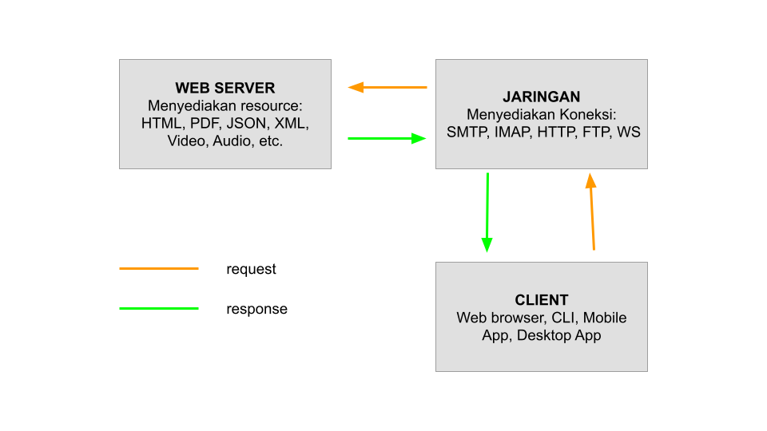
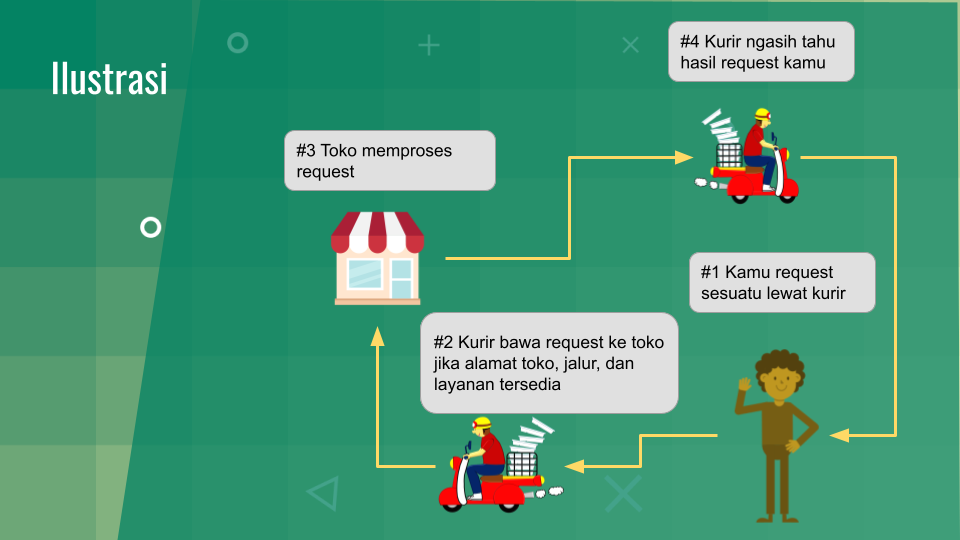

# Pengantar Teknologi Website

## Apa yang dipelajari?

Setelah mengikuti kursus ini, diharapkan Anda dapat menguasai hal-hal berikut:

- Mendemonstrasikan keterampilan dalam teknologi pengembangan aplikasi sisi klien (Front-end) seperti HTML, CSS, Javascript, dan librari-librari Javascript.
  - Pengantar Pemrograman web sisi klien
  - HTML, CSS, Javascript
  - Document Object Model (DOM)
  - Penggunaan DOM pada pemrograman web sisi klien
  - Framework pengembangan web sisi klien
  - CSS Frameworks: Bootstrap, Tailwind, UI kit, Bulma
  - Javascript Frameworks: Jquery, Vue, Axios, Konva
- Mendemonstrasikan keterampilan dalam teknologi pengembangan aplikasi web sisi server menggunakan bahasa pemrograman sisi server seperti Node/Express, Python/Django, dll.
  - Pengantar Pemrograman web sisi server
  - Bahasa pemrograman sisi server
  - PHPLingkungan pengembangan PHP
  - Node Js/Express
  - Python dan django
  - Application Programming Interface (API)
- Membuat aplikasi web yang berfungsi untuk proses bisnis tertentu menggunakan front-end, back-end, SQL, dan alat pengembangan web terkini.
  - Full Stack development
  - Keterampilan untuk membuat aplikasi web menggunakan pengembangan front-end dan back-end bersama dengan menggabungkan fungsionalitas database (CRUD)
- Menerapkan aspek keamanan untuk aplikasi web.
- Melakukan debug pada kesalahan sintak dan logika.
- Melakukan deploy aplikasi web ke hosting server.

## Terminologi Penting

| Terminologi                       | Deskripsi                                                    |
| --------------------------------- | ------------------------------------------------------------ |
| Web page                          | Sebuah dokumen yang dapat ditampilkan dalam sebuah web browser seperti Firefox, Google Chrome, Opera, Microsoft Internet Explorer atau Edge, atau Safari Apple. Ini juga sering disebut dengan istilah "halaman" atau "laman". |
| Web Site                          | Kumpulan halaman web yang dikelompokkan secara bersama dan biasanya dihubungkan dengan sebuah mekanisme navigasi. Istilah web site juga sering disebut "situs web" atau hanya "situs". |
| HTML (Hypertext Markup Language)  | Kodifikasi yang memiliki struktur khusus dan digunakan untuk menampilkan dokumen pada halaman web. |
| Web Server                        | Komputer dengan kemampuan khusus yang menyediakan dokumen-dokumen dan terhubung jaringan internet sehingga dokumen-dokumen tersebut dapat diakses melalui komputer lain yang terhubung dalam jaringan internet. |
| Web Browser                       | Perangkat lunak komputer yang digunakan untuk mengakses halaman web. |
| URL (*Uniform Resource Locator* ) | Rangkaian karakter yang menunjukkan alamat sebuah halaman web pada internet. |
| Protocol                          | Seperangkat peraturan atau prosedur untuk mengirimkan data antara perangkat elektronik (misal komputer) |
| Internet Protocol (IP) Add        | Label numerik (misalnya 192.0.2.1) yang terhubung ke jaringan komputer yang menggunakan Protokol Internet untuk komunikasi. Alamat IP melayani dua fungsi utama yaitu identifikasi antarmuka jaringan dan pengalamatan lokasi. |
| HTTP                              | *Hypertext Transfer Protocol*. Merupakan protokol pada lapisan aplikasi untuk sistem informasi hypermedia yang terdistribusi dan kolaboratif. HTTP adalah dasar komunikasi data untuk [World Wide Web](https://id.wikipedia.org/wiki/World_Wide_Web) (www). |
| API                               | *Application Programming Interface*, sebuan antarmuka yang dapat menghubungkan aplikasi satu dengan aplikasi lainnya melalui skema pemrogramman tertentu misalnya OOP (Object Oriented Programming). Pada pengembangan aplikasi sistem informasi API digunakan sebagai komunikasi data antara aplikasi sisi klien dan database pada sisi server. |

## Bagaimana Aplikasi Web Berjalan?

Gambar di atas menunjukkan skema teknologi web. Terdapat tiga komponen utama yaitu klien, jaringan, dan web server. Klien melakukan permintaan data melalui sebuah domain atau alamat IP yang mengarahkan pada sebuah halaman pada server. Jika alamat tersebut terhubung internet dan data tersedia maka server mengirimkan respon berupa dokumen kepada klien. Dokumen tersebut dapat berupa dokumen HTML, image, XML, JSON, dan beberapa dokumen lain yang dapat ditransmisikan melalui jaringan internet.

 

Gambar di atas menunjukkan ilustrasi tentang bagaimana teknologi web berjalan. Orang yang melakukan pesanan diibaratkan sebagai web browser, kurir diibaratkan sebagai jaringan internet, dan toko sebagai web server. Data yang dikirimkan dari klien ke server (request) atau dari server ke klien (response), pada ilustrasi di atas, digambarkan dengan barang-barang yang dibawa oleh kurir.

## Apa itu Client-Side Programming dan Server-Side Programming

Dalam pengembangan web terdapat dua terminologi yaitu client-side dan server-side programming. Dua istilah tersebut mengacu pada dimana program dieksekusi. 

### Client Side Programming

Client Side Programming mengacu pada eksekusi script yang dilakukan pada sisi klien misalnya pada web browser. Bahasa pemrograman untuk sisi klien diantaranya adalah HTML, CSS, dan Javascript. Karena bahasa tersebut berjalan pada sisi klien maka jika kita membuat sebuah dokumen HTML (didalamnya juga dapat memuat CSS dan Javascript) maka dokuemen tersebut dapat dieksekusi pada web browser tanpa memerlukan server untuk menjalankannya.

### Server Side Programming

Server side programming mengacu pada eksekusi script yang dilakukan pada sisi server. Bahasa pemgrograman web tipe ini memerlukan service pada mesin komputer yang mengeksekusi program tersebut. Bahasa pemrograman sisi server yang biasa digunakan untuk pengembangan web misalnya PHP, Python, dan ASP.

Anda akan dapat mempelajari dengan lebih detail mengenai hal ini pada bagian Front End Web Development dan Back End Web Development.

