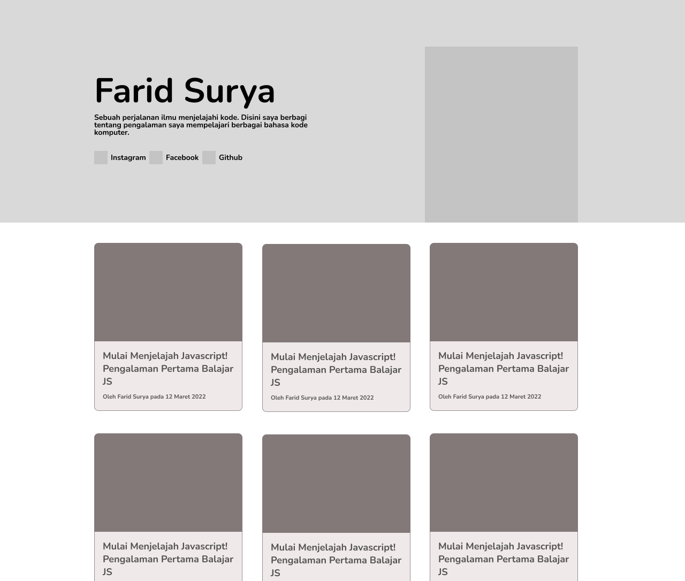

# Membuat Wireframe

## Apa itu wireframe?

Wireframing adalah cara untuk merancang halaman web dalam bentuk struktural. Wireframe dapat disebut juga sebagai gambar rangka. Gambar rangka biasanya digunakan untuk menata konten dan fungsionalitas pada halaman aplikasi. Penataan konten tersebut dilakukan dengan memperhitungkan kebutuhan pengguna dan pengalaman pengguna. Wireframe digunakan di awal proses pengembangan untuk menetapkan struktur dasar halaman sebelum desain visual dan konten ditambahkan.

!> Setelah proses wireframe, seharusnya ada proses design yaitu membuat tampilan visual sesuai dengan gambar rangka yang sudah dibuat. Tapi pada kasus ini proses desain tidak dilakukan dan menggunakan elemen-elemen desain yang sudah disediakan oleh framewok Bootstrap sebagai UI Framework yang dipakai pada studi kasus ini.

## Contoh Wireframe Aplikasi Static Blog

Berikut ini adalah contoh wireframe yang nantinya akan dibuat pada studi kasus ini. Ada dua halaman yang akan dibuat yaitu halaman beranda yang menampilkan daftar artikel dan satu halaman untuk menampilkan detail artikel.

