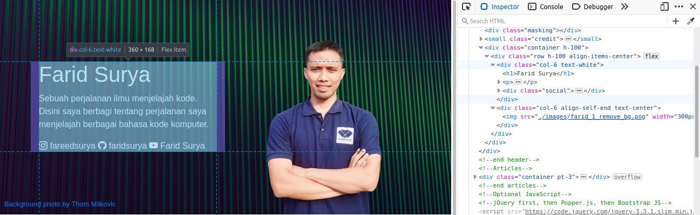
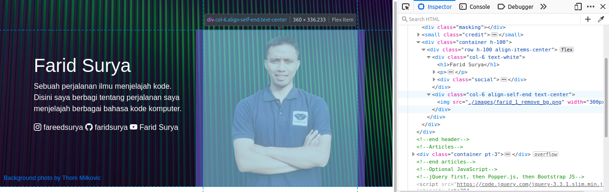

# Menata Layout Tampilan Halaman Web menggunakan Framework Bootstrap

Berdasdarkan wireframe yang sudah dibuat maka kita dapat mulai untuk membuat layout aplikasi. Pembuatan layout memerlukan dua komponen yaitu HTML dan CSS. HTML dapat dibuat dengan menciptakan sebuah dokumen HTML sedangkan CSS dapat menggunakan Framework yang sudah dibangun oleh developer lain misalnya Bootstrap.

## Membuat File Starter HTML

Starter HTML dapat kita ambil dari situs resmi [Bootstrap](https://getbootstrap.com/docs/4.3/getting-started/introduction/). Kita tinggal copy dan paste pada project yang kita buat. Berikut ini adalah contoh kode starter yang dibuat:

**1_layouting.html**

```html
<!DOCTYPE html>
<html lang="en">
  <head>
    <!-- Required meta tags -->
    <meta charset="utf-8" />
    <meta
      name="viewport"
      content="width=device-width, initial-scale=1, shrink-to-fit=no"
    />

    <!-- Bootstrap CSS -->
    <link
      rel="stylesheet"
      href="https://cdn.jsdelivr.net/npm/bootstrap@4.3.1/dist/css/bootstrap.min.css"
      integrity="sha384-ggOyR0iXCbMQv3Xipma34MD+dH/1fQ784/j6cY/iJTQUOhcWr7x9JvoRxT2MZw1T"
      crossorigin="anonymous"
    />

    <title>Hello, world!</title>
  </head>
  <body>
    <h1>Hello, world!</h1>

    <!-- Optional JavaScript -->
    <!-- jQuery first, then Popper.js, then Bootstrap JS -->
    <script
      src="https://code.jquery.com/jquery-3.3.1.slim.min.js"
      integrity="sha384-q8i/X+965DzO0rT7abK41JStQIAqVgRVzpbzo5smXKp4YfRvH+8abtTE1Pi6jizo"
      crossorigin="anonymous"
    ></script>
    <script
      src="https://cdn.jsdelivr.net/npm/popper.js@1.14.7/dist/umd/popper.min.js"
      integrity="sha384-UO2eT0CpHqdSJQ6hJty5KVphtPhzWj9WO1clHTMGa3JDZwrnQq4sF86dIHNDz0W1"
      crossorigin="anonymous"
    ></script>
    <script
      src="https://cdn.jsdelivr.net/npm/bootstrap@4.3.1/dist/js/bootstrap.min.js"
      integrity="sha384-JjSmVgyd0p3pXB1rRibZUAYoIIy6OrQ6VrjIEaFf/nJGzIxFDsf4x0xIM+B07jRM"
      crossorigin="anonymous"
    ></script>
  </body>
</html>
```

Kode di atas memuat tiga file utama yang dilampirkan dalam dokumen HTML:

- **Bootstrap CSS**. Ini adalah kumpulan CSS yang sudah disediakan untuk membuat aplikasi berbasis web. Sebenarnya, untuk membuat aplikasi web tidak selalu memerlukan Bootstrap CSS. Kita dapat membuat kode-kode CSS sendiri. Tapi dengan menggunakan Framework bootstrap maka sebagian pekerjaan sudah selesai. Kita tinggal mengerjakan bagian lain.
-  **Jquery**. Ini adalah library Javascript yang diperlukan oleh bootstrap. Dengan kata lain, dapat dikatakan bahwa Framework bootstrap, terutama untuk bagian Javascript, berjalan didalam Jquery.
- **Popper**. Ini juga termasuk library javascript yang diperlukan oleh beberapa fungsi yang dijalankan oleh Bootstrap.
- **Bootstrap**. Ini adalah bagian Framework bootsrap untuk menangani beberapa fungsi yang memerlukan javascript.

?> **Bisakah hanya melampirkan bootstrap.css tanpa javascript?** Bisa. Javascript pada bootstrap adalah untuk menjalankan fungsi-fungsi tertentu seperti drowpdown, alert, dismiss, dll. Semua fungsi yang memuat aspek animasi menggunakan Javascript. Tapi, untuk aspek-aspek visual hanya menggunakan bootstrap.css.

## Latihan

Cara melampirkan file-file yang diperlukan pada Framework Bootstrap pada kode `1_layouting.html` adalah menggunakan URL yang mengarah pada situs tertentu misalnya `https://cdn.jsdelivr.net`. 

1. [Unduh](https://getbootstrap.com/docs/4.3/getting-started/download/) file-file yang diperlukan dan simpan pada repositori lokal Anda.
2. Ganti lampiran bootstrap.css, Jquery.js, popper.js, dan bootstrap.js sehingga mengarah ke file lokal.

## Penggunaan Grid untuk Mengatur Layout

Komponen CSS yang sangat bermanfaat untuk mengatur tata letak tampilan adalah flex. Anda dapat mempelajari konsep dasar tentang flex pada bagian Front End Web Development khsusunya materi tentang CSS. Framework bootstrap yang dipakai pada studi kasus ini menyediakan konsep grid yang didalamnya menggunakan konsep dasar flex css. Kita akan memanfaatkan grid untuk membuat aspek tata-letak dalam pengembangan tampilan antar muka pengguna.

### Grid untuk membuat blok header

Perhatikan lagi blok header pada wireframe yang sudah dibuat. Untuk mengkonversi wireframe tersebut dalam layout, kita perlu menganalisa elemen HTML yang nantinya dipakai dan class apa yang dipakai pada elemen tersebut. 


**Gambar 2.1** *Pemetaan class pada elemen HTML*

Gambar di atas menunjukkan pemetaan elemen HTML yang akan digunakan pada blok header. Ada tiga elemen utama yang ditampilkan:

- Background cover
- Blok informasi yang memua teks (heading, paragraph, dan social media)
- Blok gambar

Implementasi pemetaan pada gambar di atas adalah kode berikut yang diterapkan di dalam `body`.

**1_layouting.html**

```html
<!--Header-->
    <div class="cover" style="background-image: url(./images/thom-milkovic-qGQIOLke2kE-unsplash.jpg);">
      <div class="masking"></div>
      <small class="credit"><a href="">Background photo by Thom Milkovic</a></small>
      <div class="container h-100">
        <div class="row h-100 align-items-center">
          <div class="col-6 text-white">
            <h1>Farid Surya</h1>
            <p>Sebuah perjalanan ilmu menjelajah kode. Disini saya berbagi tentang perjalanan saya menjelajah berbagai bahasa kode komputer. </p>
            <div class="social">
              <a href=""><i class="bi-instagram"></i> fareedsurya</a>
              <a href=""><i class="bi-github"></i> faridsurya</a>
              <a href=""><i class="bi-youtube"></i> Farid Surya</a>
            </div>
          </div>
          <div class="col-6 align-self-end text-center">
            
          </div>
        </div>
      </div>   
    </div>
    <!--end header-->
```

```css
/*style.css*/
.cover {
  position: relative;
  background-position: center;
  background-size: cover;
  height: 400px;
}
.cover .masking {
  position: absolute;
  width: 100%;
  bottom: 0;
  top: 0;
  background-color: black;
  opacity: 0.5;
  z-index: 0;
}
.cover .credit {
  position: absolute;
  left: 10px;
  bottom: 10px;
}
.cover .social a {
  color: white;
}
```

**Pratinjau:**

[Preview Hasil](https://codepen.io/faridsurya/embed/popNdMo ':include :type=iframe width=100% height=350px')

*Untuk melihat tampilan yang menyerupai desktop gunakan perbesaran 0.5x*

#### Membuat Elemen HTML Menjadi Rata Tengah Secara Vertikal

Perataan secara vertikal sering digunakan dalam pengembangan aplikasi web. Pada bootstrap, fungsi tersebut dijalankan oleh grid terutama menggunakan class `align-items-center` yang diterapkan setelah class `row`. Tapi ada persyaratan tertentu agar fungsi perataan secara vertikal ini berfungsi, diantaranya:

- Perataan vertikal berjalan jika elemen diatasnya memiliki definisi tinggi yang jelas. Gambar 2.1 menggambarkan bahwa `align-items-center` berada di dalam class `cover` yang tingginya terdefinisi dengan jelas yaitu 400px seperti pada kode `style.css`.

- Perataan vertikal yang diterapkan pada class `row` akan berdampak pada elemen didalamnya yaitu elemen dengan class `col-`. 

  

  Gamba di atas menunjukkan hasil inspector browser yang menunjukkan bahwa elemen dengan class `row` memiliki tinggi 100% karena pada `row` juga diterapkan class `h-100`. Tapi, elemen dengan class `col` berada di tengah secara vertikal.

- Perataan vertikal dapat juga diterapkan pada class `col-` dengan cara menerapkan class `align-self-[position]`. Pada kode `1_layouting.html` konsep tersebut diterapkan untuk membuat gambar selalu menempel di batas bawah elemen `col-`. 

  

### Grid dan Card untuk membuat blok Articles

Sesuai dengan wireframe yang sudah dibuat, terdapat satu blok lagi yang harus dibuat yaitu blok yang memuat daftar artikel secara grid. Untuk membuat blok tersebut kita dapat menggunakan lagi komponen grid pada bootstrap yaitu `row` dan `col`. 

**1_layout.html**

```html
<!--Articles-->
    <div class="container pt-3">
      <div class="row">
        
        <div class="col-md-4">
          <div class="card">
            
            <div class="card-body">
              <h5 class="card-title">Card title</h5>
              <p class="card-text">Some quick example text to build on the card title and make up the bulk of the card's content.</p>
              <a href="#" class="btn btn-primary">Go somewhere</a>
            </div>
          </div>
        </div> 
        
        <div class="col-md-4">
          <div class="card">
            
            <div class="card-body">
              <h5 class="card-title">Card title</h5>
              <p class="card-text">Some quick example text to build on the card title and make up the bulk of the card's content.</p>
              <a href="#" class="btn btn-primary">Go somewhere</a>
            </div>
          </div>
        </div> 

        <div class="col-md-4">
          <div class="card">
            
            <div class="card-body">
              <h5 class="card-title">Card title</h5>
              <p class="card-text">Some quick example text to build on the card title and make up the bulk of the card's content.</p>
              <a href="#" class="btn btn-primary">Go somewhere</a>
            </div>
          </div>
        </div> 

      </div>

    </div>

    <!--end articles-->
```

**Pratinjau:**

[Preview](https://codepen.io/faridsurya/embed/NWXbYVJ ':include :type=iframe width=100% height=450px')

*Untuk melihat tampilan yang menyerupai desktop gunakan perbesaran 0.5x*

