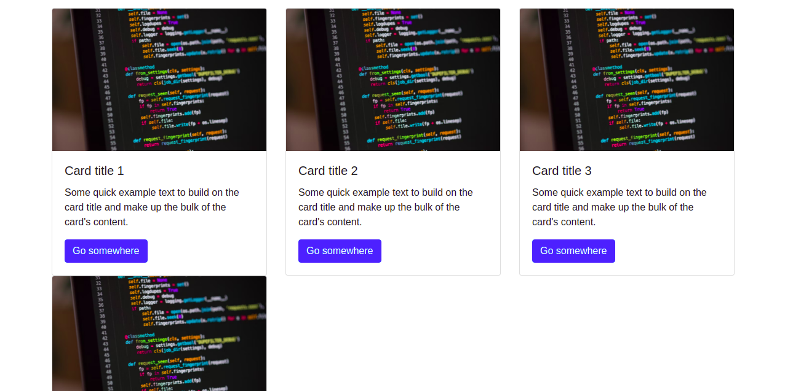
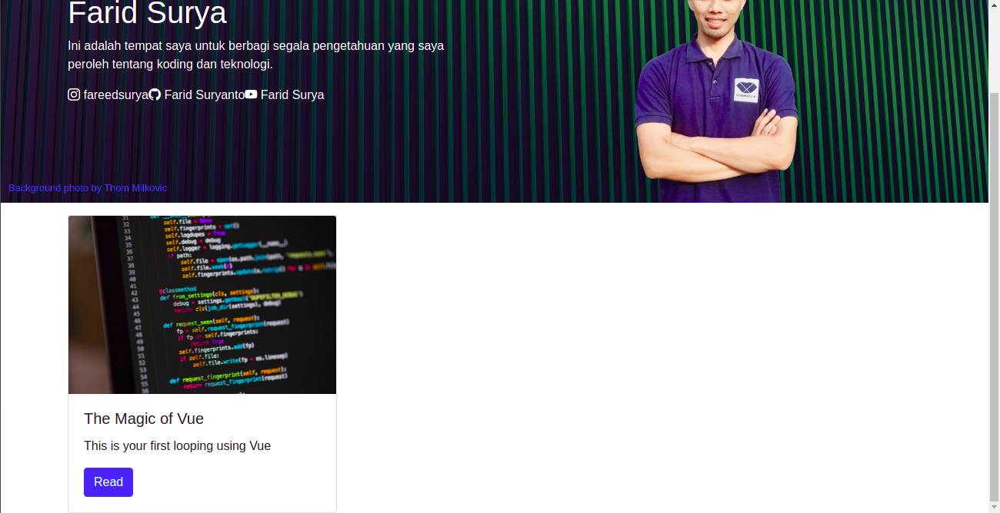

# Instalasi Vue.js

## Apa yang dipelajari?

- Apa itu vue?
- Instalasi vue
- Declarative Rendering
- Kondisional dan Perulangan

## Apa itu Vue?

Vue adalah framework (kerangka kerja) berbasis javascript. Menurut laman resminya, vue merupakan framework progresif yang memungkinkan pengembang menggunakan vue pada project yang sudah ada ataupun dapat juga menggunakan pola aplikasi satu halaman (single page app) seperti yang dapat dilakukan menggunakan framework lain misalnya React atau Angular. 

Saya memilih vue sebagai framework yang pertama dikenalkan kepada para pengembang pemula karena sifatnya yang dapat dimasukkan dalam project yang sudah ada. Secara sederhana, vue dapat dimasukkan pada dokumen HTML yang sudah ada untuk memudahkan beberapa fungsi yang sulit diakukan menggunakan javsacript murni (tanpa framework) dengan melampirkan library vue.js ke dalam dokumen HTML yang sudah ada. Kita akan menerapkannya pada studi kasus ini!

## Instalasi Vue

Vue dapat dipasang pada project yang sudah ada dengan melampirkan library Vue pada elemen `<script>`. Berikut ini adalah salah satu cara instalasi Vue pada dokumen HTML:

```html
<script src="https://unpkg.com/vue@3"></script>
```

Berikutnya Anda harus melakukan konfigurasi agar Vue dapat digunakan pada project Anda. Beberapa langkah yang harus dilakukan adalah:

1. Memasang selector menggunakan atribut `id` pada elemen HTML. Pada kasus ini kita pasang selector pada elemen `<body>`. Anda dapat memasangnya pada elemen lain, tapi Vue hanya akan berlaku untuk elemen-elemen HTML yang berada pada selector tersebut.

   ```html
   <body id="app">
       <!--Kode Anda ada disini-->
   </body>
   ```

2. Membuat file javascript untuk menuliskan kode konfigurasi dan pemrograman menggunakan Vue. Anda dapat juga menuliskan kode Javasript secara langsung pada dokumen HTML, tapi pada contoh kasus ini kita akan pasang kode tersebut pada file yang terpisah.

   ```html
    <script src="https://unpkg.com/vue@3"></script>
    <script src="./main.js"></script> <!--kode ini harus berada dibawah library vue-->
   ```

   Perhatikan! Kode yang digunakan untuk pengaturan dan pemrograman menggunakan Vue harus berada dibawah library Vue.

3. Menuliskan kode konfigurasi Vue. Berikut ini adalah contoh konfigurasi Vue pada file `main.js`.

   ```javascript
   Vue.createApp({
       data() {
         return {
           message: 'Hello Vue!'
         }
       }
     }).mount('#app')
   ```

   Baris kode `.mount('#app')` mengacu pada id yang ditetapkan pada elemen `<body id="app">`.

Konfigurasi Vue sudah selesai, berikutnya adalah mencoba fungsi-fungsi yang disediakan oleh Vue untuk melakukan pengelolaan data pada aplikasi web.

!> Jika Anda menggunakan Vue maka pada elemen HTML yang Anda gunakan tidak boleh menggunakan atribut style yang dipasang pada elemen HTML misalnya: `width, height`. Jika masih ada kode-kode tersebut misalnya pada elemen `` maka atribut `width` harus Anda buat menggunakan class atau menggunakan inline css dengan atribut `style="width=300px"`.

## Declarative Rendering

Secara sederhana *declarative rendering* merupakan cara untuk menampilkan variabel atau objek javascript dalam dokumen HTML. Misalnya kita mempunyai variabel javascript `title = 'Welcome Vue!'` maka variabel menggunakan *declarative rendering*, kita dapat menampilkan teks 'Welcome Vue' hanya dengan menyematkan variabel `title` pada dukumen HTML. Tentunya dengan penanda khusus, misalnya, `{{title}}`. 

Pada studi kasus ini kita akan mengganti tampilan header menggunakan *declarative rendering*. Lakukan modifikasi file `main.js` sehingga menjadi seperti berikut ini:

```javascript
Vue.createApp({
  data() {
    return {
      message: "Hello Vue!",
      header: {
        title: "Farid Surya",
        description:
          "Ini adalah tempat saya untuk berbagi segala pengetahuan yang saya peroleh tentang koding dan teknologi.",
        social: {
          ig: {
            url: "https://instagram.com/fareedsurya",
            title: "fareedsurya",
          },
          fb: {
            url: "https://facebook.com/fareedsurya",
            title: "Farid Suryanto",
          },
          yt: {
            url: "https://www.youtube.com/channel/UC8GBH6hewlRM1q252mSMyXg",
            title: "Farid Surya",
          },
        },
        imageProfile:
          "https://raw.githubusercontent.com/faridsurya/Vue-Axios-Basic/master/images/farid_1_remove_bg.png",
      },
    };
  },
}).mount("#app");

```

`header` merupakan sebuah objek yang berisi data-data yang diperlukan untuk ditampilkan pada blok header. Setelah data tersebut ditentukan maka kita akan tampilkan data tersebut pada blok header di dokumen HTML. Lakukan modifikasi kode pada file `2_vue_install.html` menjadi seperti berikut ini:

```html
    <!--Header-->
    <div class="cover" style="background-image: url(./images/thom-milkovic-qGQIOLke2kE-unsplash.jpg);">
      <div class="masking"></div>
      <small class="credit"><a href="">Background photo by Thom Milkovic</a></small>
      <div class="container h-100">
        <div class="row h-100 align-items-center">
          <div class="col-6 text-white">
            <h1>{{header.title}}</h1>
            <p>{{header.description}}</p>
            <div class="social">
              <a v-bind:href="header.social.ig.url"><i class="bi-instagram"></i> {{header.social.ig.title}}</a>
              <a v-bind:href="header.social.fb.url"><i class="bi-github"></i> {{header.social.fb.title}}</a>
              <a v-bind:href="header.social.yt.url"><i class="bi-youtube"></i> {{header.social.yt.title}}</a>
            </div>
          </div>
          <div class="col-6 align-self-end text-center">
            
          </div>
        </div>
      </div>   
    </div>
    <!--end header-->
```

Perhatikan kode di atas. `{{header.title}}` merupakan sebuah *declarative rendering* yang menampilkan objek `header.title` yang terdapat pada `main.js`. Jika Anda akan menampilkan variabel didalam elemen HTML maka Anda perlu menggunakan tanda `{{}}`.

Tapi perhatikan pada atribut `v-bind:href="header.social.ig.url"`. Pada baris tersebut tidak memakai tanda `{{}}` karena atribut `v-bind` memerlukan variabel javascript. Jika Anda ingin melampirkan URL dengan tipe data string misalnya `https://google.com`,  misalnya, maka Anda perlu menambahkan tanda kutip `''` didalamnya agar didefinisikan sebagai variabel string. Misalnya menuliskan `v-bind:href="'https://google.com'"`. 

**Tips melampirkan gambar dari repositori github**

Url yang Anda peroleh dari github:

```
https://github.com/faridsurya/Vue-Axios-Basic/blob/master/images/farid_1_remove_bg.png
```

Url yang Anda lampirkan pada atribut `src`:

```
https://raw.githubusercontent.com/faridsurya/Vue-Axios-Basic/master/images/farid_1_remove_bg.png
```

## Kondisional dan Perulangan

Kondisional dan perulangan adalah fitur yang sangat memudahkan pada proses pengembangan web berbasis front end. Kita dapat membuat kondisional dan perulangan untuk elemen-elemen HTML pada pemrograman sisi klien. Itu biasanya hanya dapat dilakukan pada pemrograman sisi server misalnya menggunakan PHP, Python, Go, dsb. Tapi dengan menggunakan library Vue kita dapat melakukannya dengan mudah pada pemrograman sisi klien.

### Kondisional

Kita terapkan kondisional pada blok desain header. Perhatikan contoh berikut:

```html
 <!--Header-->
    <div v-if="true" class="cover" style="background-image: url(./images/thom-milkovic-qGQIOLke2kE-unsplash.jpg);">
      <div class="masking"></div>
      <small class="credit"><a href="">Background photo by Thom Milkovic</a></small>
      <div class="container h-100">
        <div class="row h-100 align-items-center">
          <div class="col-6 text-white">
            <h1>{{header.title}}</h1>
            <p>{{header.description}}</p>
            <div class="social">
              <a v-bind:href="header.social.ig.url"><i class="bi-instagram"></i> {{header.social.ig.title}}</a>
              <a v-bind:href="header.social.fb.url"><i class="bi-github"></i> {{header.social.fb.title}}</a>
              <a v-bind:href="header.social.yt.url"><i class="bi-youtube"></i> {{header.social.yt.title}}</a>
            </div>
          </div>
          <div class="col-6 align-self-end text-center">
            
          </div>
        </div>
      </div>   
    </div>
    <!--end header-->
```

Pada blok header di atas terdapat atribut `v-if="true"`. Itu adalah cara untuk melakukan kondisional untuk elemen HTML. Jika nilai `v-if` di berikan `false` maka elemen tersebut tidak ditampilkan. Cara tersebut biasanya digunakan untuk membuat efek loading, menampilkan status, menampilkan elemen berdasdarkan kondisi tertentu, dsb. Anda akan belajar lebih dalam tentang konsep tersebut pada studi kasus yang lebih kompleks.

### Perulangan

Data adalah komponen penting dalam pengembangan aplikasi. Saat ini pengambangan aplikasi sisi klien sudah  dapat melakukan penampilan data array atau JSON yang diambil dari server dengan konsep perulangan seperti yang biasanya dilakukan pada sisi server.

Framework Vue menyediakan fitur perulangan yang dapat digunakan secara mudah. Pada studi kasus ini kita menggunakan konsep perulangan untuk menampilkan daftar artikel. Layout untuk daftar artikel sudah kita buat pada materi sebelumnya.

Untuk melakukan perulangan pada Vue, perhatikan contoh berikut. Ini adalah kode yang diambil dari blok artikel pada file `1_layouting.html`. 

```html
<!--Articles-->
    <div class="container pt-3">
      <div class="row">
        
        <div class="col-md-4" v-for="item in [1,2,3,4]">
          <div class="card">
            
            <div class="card-body">
              <h5 class="card-title">Card title {{item}}</h5>
              <p class="card-text">Some quick example text to build on the card title and make up the bulk of the card's content.</p>
              <a href="#" class="btn btn-primary">Go somewhere</a>
            </div>
          </div>
        </div>   

      </div>

    </div>
    <!--end articles-->
```

 Perhatikan kode ini: ` v-for="item in [1,2,3,4]"`. Itu adalah atribut untuk melakukan perulangan pada Vue. `[1,2,3,4]` adalah data dalam format Array. Variabel `item` adalah variabel untuk setiap nilai pada Array. Perhatikan lagi contoh di atas. Terdapat *declarative rendering* `{{item}}` pada bagian card title. Itu akan diganti dengan nilai setiap data pada Array. 

Jumlah data pada Array adalah 4 data. Oleh sebab itu elemen HTML dimana atribut `v-for` berada akan diulang sebanyak data Array. Pada kasus di atas perulangan dilakukan sebanyak empat kali. Hasil dari penerapan perulangan tersebut adalah sebagai berikut:



Data Array dapat juga diambil dari fungsi javascript di file `main.js`. Kita coba membuat data array `articles` yang nantinya akan ditampilkan pada blok artikel. Lakukan perubahan pada file `main.js`:

```javascript
...
articles: [
        {
          title: 'The Magic of Vue',
          description: "This is your first looping using Vue",
          thumbnail: 'https://images.unsplash.com/photo-1515879218367-8466d910aaa4?ixlib=rb-1.2.1&ixid=MnwxMjA3fDB8MHxwaG90by1wYWdlfHx8fGVufDB8fHx8&auto=format&fit=crop&w=869&q=80'
        }
      ]
...
```

Berikutnya, lakukan modifikasi pada file html:

```html
...
<div class="col-md-4" v-for="item in articles">
          <div class="card">
            
            <div class="card-body">
              <h5 class="card-title">{{item.title}}</h5>
              <p class="card-text">{{item.description}}</p>
              <a href="#" class="btn btn-primary">Read</a>
            </div>
          </div>
        </div>   
....
```

Hasilnya akan tampil seperti pada gambar berikut:



Contoh kode lengkap ada di https://github.com/faridsurya/Vue-Axios-Basic

